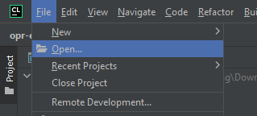

# "Objektorientierte Programmierung (OPR)"

This repository includes example solutions for several exams, intended to help you compare with your own work.

Note: There may be multiple valid approaches—these are just examples.

Disclaimer: These solutions are provided as-is and may contain errors.

### Usage:

#### With CLion (should also work on Windows):
1. Clone the repository *or* download & unpack the zip file

    

2. Start CLion and open the project

    
    

3. Build using Toolbar in upper right corner

    

#### On Linux:
Follow steps mentioned above for CLion-IDE or use any IDE you like and call the build-script with `./build.sh build`